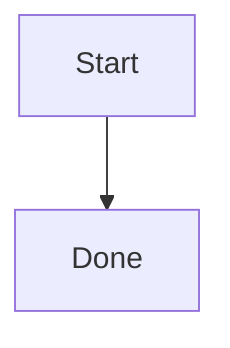

# @lark.js/docs

Composable helpers for VitePress. The package does two things:

- Generates `themeConfig.nav` and `themeConfig.sidebar` from the directory
  structure of your docs folder, so you never hand-write them.
- Renders ` ```mermaid ` code fences as diagrams through a `<wc-mermaid>`
  custom element built with Lit, including automatic re-render when the
  VitePress light/dark theme changes.

Everything is a plain function that you wire into the native VitePress
`defineConfig()`. The package never wraps or rewrites your config.

ESM only. VitePress 1 or 2 is a peer dependency; `lit` and `mermaid` are
regular dependencies, so consumers install nothing else for diagrams.

## Install

```sh
pnpm add -D @lark.js/docs vitepress
```

## Quick start

`.vitepress/config.ts`:

```ts
import { defineConfig } from "vitepress";
import { buildNav, buildSidebar, installMermaidFence, MERMAID_TAG } from "@lark.js/docs";

export default defineConfig({
  title: "My Docs",
  srcDir: "docs",
  themeConfig: {
    nav: buildNav("docs"),
    sidebar: buildSidebar("docs"),
  },
  markdown: { config: installMermaidFence },
  vue: {
    template: {
      compilerOptions: { isCustomElement: (tag) => tag === MERMAID_TAG },
    },
  },
  vite: {
    optimizeDeps: {
      exclude: ["@lark.js/docs"],
      include: ["@lark.js/docs > mermaid"],
    },
    ssr: { noExternal: ["@lark.js/docs"] },
  },
});
```

`.vitepress/theme/index.ts`:

```ts
export { default } from "@lark.js/docs/theme";
```

If the site uses Tailwind CSS v4, add one line to the CSS entry so Tailwind
generates the utility classes used by the mermaid element (Tailwind does not
scan `node_modules` by default):

```css
@import "tailwindcss";
@source "../../node_modules/@lark.js/docs/dist";
```

That is the whole setup. Write markdown under `srcDir`, and use mermaid
fences anywhere:

````md

````

## API

### `buildNav(srcDir?)` and `buildSidebar(srcDir?)`

Scan the docs directory and return values for `themeConfig.nav` and
`themeConfig.sidebar`:

- `buildNav`: a `homepage` link to `/`, then one dropdown per top-level
  directory, listing that directory's markdown files. `index.md` files are
  skipped.
- `buildSidebar`: one group per top-level directory. Nested directories
  become collapsed groups, recursively. Files sort with numeric awareness,
  so `2-foo.md` comes before `10-bar.md`.

`srcDir` (default `"."`) is resolved against `process.cwd()`, which matches
running `vitepress dev` / `vitepress build` from the site root — pass the
same value as the VitePress `srcDir` option. Directories named
`node_modules`, `public`, `dist`, or starting with a dot are ignored.

Both are plain functions returning plain data, so mixing generated and
hand-written entries is ordinary array/object composition.

### `installMermaidFence(md)`

A markdown fence rule that turns ` ```mermaid ` blocks into `<wc-mermaid>`
tags; other fences keep the default renderer. Pass it directly as
`markdown.config`, or call it from your own config function alongside other
markdown-it setup:

```ts
markdown: {
  config(md) {
    installMermaidFence(md);
    // md.use(...) other plugins
  },
},
```

### `MERMAID_TAG`

The custom element tag name (`"wc-mermaid"`). Vue must be told that the tag
is a custom element, or the SSR build warns about an unresolvable component:

```ts
vue: {
  template: {
    compilerOptions: { isCustomElement: (tag) => tag === MERMAID_TAG },
  },
},
```

### The `vite` block

`@lark.js/docs` is ESM-only and registers the element with a client-side
dynamic import, so the mermaid setup needs both entries:

- `optimizeDeps.exclude: ["@lark.js/docs"]` keeps the dev server from
  prebundling the package.
- `optimizeDeps.include: ["@lark.js/docs > mermaid"]` prebundles the nested
  `mermaid` dependency. Because the package itself is excluded, its
  `import("mermaid")` is served as source in dev, and mermaid's CommonJS
  dependencies (such as `dayjs`) would reach the browser without ESM interop
  and fail — pnpm's isolated `node_modules` hits this reliably.
- `ssr.noExternal: ["@lark.js/docs"]` makes Vite bundle it during the
  VitePress SSR build instead of externalizing it.

Only the mermaid feature needs the `markdown` / `vue` / `vite` blocks; a
site that just wants generated nav/sidebar can use `buildNav` /
`buildSidebar` alone.

## Mermaid element

`<wc-mermaid graph="...">` receives the fence content URI-encoded. The
element renders into light DOM, imports `mermaid` lazily in the browser
(never during SSR), and shows the diagram SVG centered with horizontal
scrolling for wide graphs. It watches the `dark` class on `<html>` and
re-renders with the matching mermaid theme. Styling uses Tailwind utility
classes only, which is why the `@source` line above matters; without
Tailwind the diagram still renders, just without spacing and centering.

## Custom themes

`@lark.js/docs/theme` extends the VitePress default theme. If the site
already has its own theme (for example one based on
`vitepress/theme-without-fonts`), keep it and register only the element in
`enhanceApp`:

```ts
enhanceApp() {
  if (typeof window !== "undefined") {
    void import("@lark.js/docs/element");
  }
}
```

The `window` guard is required: the element module calls
`customElements.define` at import time, which does not exist in Node during
the VitePress SSR build.

## Exports

| Entry                   | Purpose                                                                      |
| ----------------------- | ---------------------------------------------------------------------------- |
| `@lark.js/docs`         | `buildNav`, `buildSidebar`, `installMermaidFence`, `MERMAID_TAG` (Node side) |
| `@lark.js/docs/theme`   | Drop-in theme extending the VitePress default theme                          |
| `@lark.js/docs/element` | Registers `<wc-mermaid>`; import client-side from custom themes              |

## License

MIT
