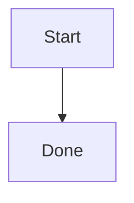

# @lark.js/docs

Helpers that make VitePress work out of the box. The package does two things:

- Generates `themeConfig.nav` and `themeConfig.sidebar` from the directory
  structure of your docs folder, so you never hand-write them.
- Renders ` ```mermaid ` code fences as diagrams through a `<wc-mermaid>`
  custom element built with Lit, including automatic re-render when the
  VitePress light/dark theme changes.

ESM only. VitePress 1 or 2 is a peer dependency; `lit` and `mermaid` are
regular dependencies, so consumers install nothing else for diagrams.

## Install

```sh
pnpm add -D @lark.js/docs vitepress
```

## Quick start

`.vitepress/config.ts`:

```ts
import { defineDocsConfig } from "@lark.js/docs";

export default defineDocsConfig({
  title: "My Docs",
  srcDir: "docs",
  // every other native VitePress option works as usual
});
```

`.vitepress/theme/index.ts`:

```ts
export { default } from "@lark.js/docs/theme";
```

If the site uses Tailwind CSS v4, add one line to the CSS entry so Tailwind
generates the utility classes used by the mermaid element (Tailwind does not
scan `node_modules` by default):

```css
@import "tailwindcss";
@source "../../node_modules/@lark.js/docs/dist";
```

That is the whole setup. Write markdown under `srcDir`, and use mermaid
fences anywhere:

````md

````

## What defineDocsConfig injects

`defineDocsConfig()` wraps VitePress `defineConfig()` and fills in:

- `themeConfig.nav`: a `homepage` link to `/`, then one dropdown per
  top-level directory under `srcDir`, listing that directory's markdown
  files. `index.md` files are skipped.
- `themeConfig.sidebar`: one group per top-level directory. Nested
  directories become collapsed groups, recursively. Files sort with numeric
  awareness, so `2-foo.md` comes before `10-bar.md`.
- A markdown fence rule that turns ` ```mermaid ` blocks into
  `<wc-mermaid>` tags. Other fences keep the default renderer.
- `vue.template.compilerOptions.isCustomElement` for the `wc-mermaid` tag.
- `vite.optimizeDeps.exclude` and `vite.ssr.noExternal` entries for
  `@lark.js/docs` itself.

Your own values win. If the config passes `themeConfig.nav` or
`themeConfig.sidebar`, generation for that field is skipped. A user
`markdown.config` runs after the fence rule, and a user `isCustomElement`
is composed with the built-in one.

The docs directory is resolved as `process.cwd()` joined with `srcDir`
(default `"."`), which matches running `vitepress dev` / `vitepress build`
from the site root. Directories named `node_modules`, `public`, `dist`, or
starting with a dot are ignored.

## Mermaid element

`<wc-mermaid graph="...">` receives the fence content URI-encoded. The
element renders into light DOM, imports `mermaid` lazily in the browser
(never during SSR), and shows the diagram SVG centered with horizontal
scrolling for wide graphs. It watches the `dark` class on `<html>` and
re-renders with the matching mermaid theme. Styling uses Tailwind utility
classes only, which is why the `@source` line above matters; without
Tailwind the diagram still renders, just without spacing and centering.

## Custom themes

`@lark.js/docs/theme` extends the VitePress default theme. If the site
already has its own theme (for example one based on
`vitepress/theme-without-fonts`), keep it and register only the element in
`enhanceApp`:

```ts
enhanceApp() {
  if (typeof window !== "undefined") {
    void import("@lark.js/docs/element");
  }
}
```

The `window` guard is required: the element module calls
`customElements.define` at import time, which does not exist in Node during
the VitePress SSR build.

## Exports

| Entry                   | Purpose                                                          |
| ----------------------- | ---------------------------------------------------------------- |
| `@lark.js/docs`         | `defineDocsConfig()`, used in `.vitepress/config.ts` (Node side) |
| `@lark.js/docs/theme`   | Drop-in theme extending the VitePress default theme              |
| `@lark.js/docs/element` | Registers `<wc-mermaid>`; import client-side from custom themes  |

## License

MIT
