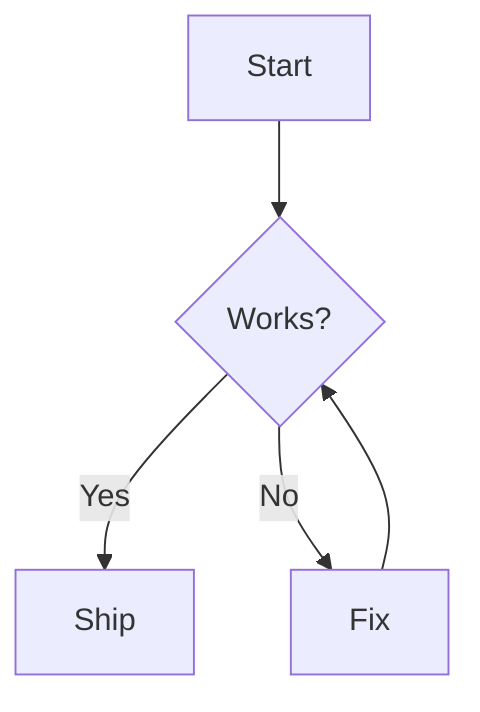
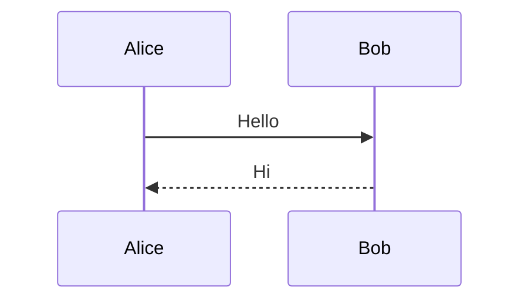

# Mermaid

A flowchart:


```mermaid
graph TD
  A[Start] --> B{Works?}
  B -->|Yes| C[Ship]
  B -->|No| D[Fix]
  D --> B
```

A sequence diagram:


```mermaid
sequenceDiagram
  Alice->>Bob: Hello
  Bob-->>Alice: Hi
```

A normal code fence must still highlight:

```ts
export const answer: number = 42;
```
